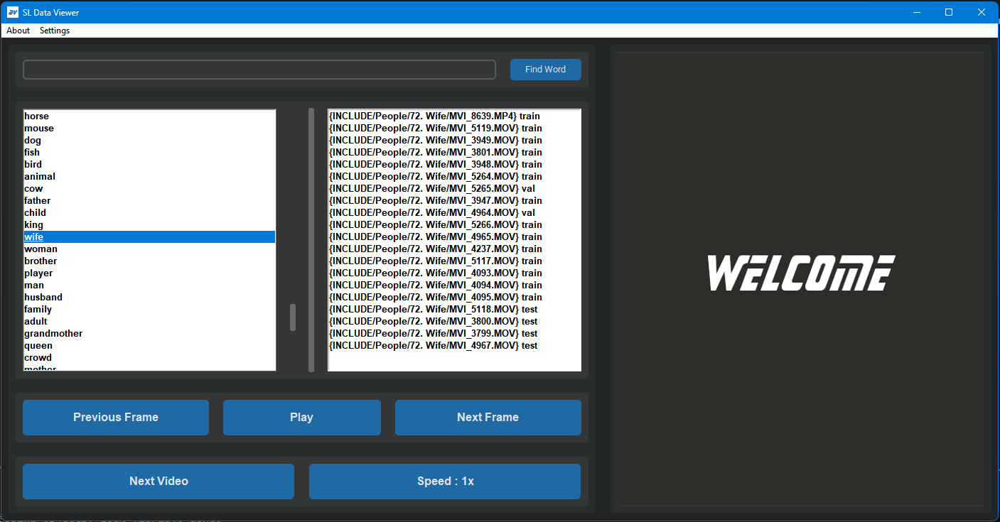

# Sign Language Dataset Viewer Application

Welcome to the Sign Language (SL) Dataset Viewer Application! This project aims to provide a organised way to view Sign Language datasets, enabling users to analyse SL datasets easily. This README file will guide you through the features, installation and usage for the application.



## Table of Contents
- [Features](#features)
- [Installation](#installation)
- [Usage](#usage)
- [License](#license)

## Features

- **Video Demonstrations**: View video demonstrations of each sign with train, test and validation split for better dataset analysis.
- **Search Functionality**: Quickly find specific signs using the search feature which allows prefix search also.
- **Speed and Frame Check**: See sign videos in different speed and have feature to check frame by frame.
- **User-Friendly Interface**: Simple and intuitive interface for ease of use.

## Installation

To run the SL Dataset Viewer Application locally, follow these steps:

1. **Clone the Repository**:
    ```bash
    git clone https://github.com/suvajit-patra/sl-dataset-viewer.git
    cd sl-dataset-viewer
    ```

2. **Install Dependencies**:
    Make sure you have `tkinter` installed with the following libraries installed:
    ```
    opencv-python==4.6.0.66
    imageio==2.22.2
    customtkinter==4.6.3
    ```

3. **Download Data**:
    Download any sign language dataset from their corresponding sources.

4. **Generate Metadata**:
    Go to [this repository](https://github.com/suvajit-patra/sl-hwgat) and run the metadata generator or make your own script to make the metadata similar to the [example metadata](metadata_include.csv) where `video_dir` is the relative path of the video from the dataset `root`. 

5. **Start the Application**:
    ```
    python data_viewer.py
    ```

## Usage

Once the application is running, you can:

- **Search for Signs**: Use the search box to find signs for specific words.
- **Watch Videos**: Click on words and click on any dataset video to watch video of the signs.
- **Analyse**: Use the application as an analysis tool to ease your research work in any Sign Language dataset.

## License

This project is licensed under the MIT License. See the [LICENSE](LICENSE) file for details.

---

Thank you for using this repository. For any questions or support, please open an issue in this repository.

---
